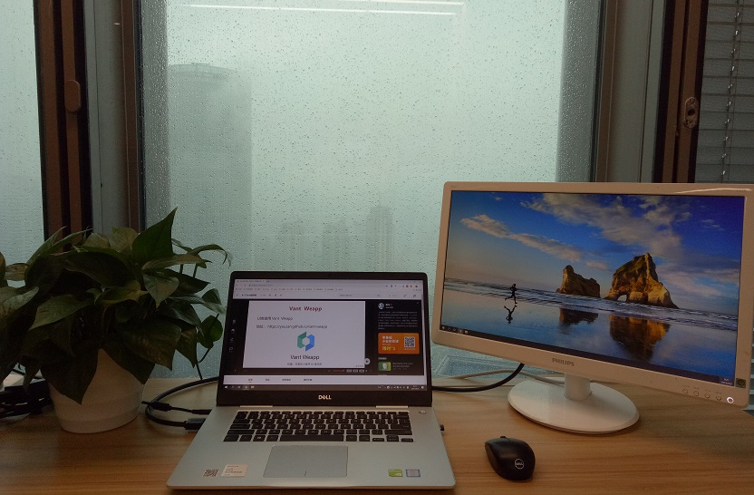

# learning-repository

---

- 这是一个学习仓库，里面记录自己的学习经验和想法。
- 为了提升阅读体验，已将本库部署为在线小册，[点击阅读](https://wtxiaomage.github.io/learning-repository/)
   

### 一、初心不改

- 一直以来都想建一个自己学习的经验和想法的笔记，但是很多时候疲于奔命，很少停下来反思，最近因为发现自己曾经学过的东西有很多好的想法都忘记了，痛定思痛，决定从现在开始慢慢累积，把自己学到的点点滴滴都记录下来，希望看着这个仓库越来越繁荣。

### 二、仓库目录

| 目录                                                   | 详情                                       |
| ------------------------------------------------------ | ------------------------------------------ |
| [Git](./src/Git/README.md) | Git基本命令 |
| [React](./src/React/README.md) | React相关知识 |
| [Vue](./src/Vue/README.md) | Vue相关知识 |

### 三、学习环境

- 推荐一个网站，[慕课网](https://www.imooc.com/)

    

### 四、赞助不断

- 如果觉得对您有帮助，欢迎star和clone
- 读后有收获可以请作者喝咖啡

    

