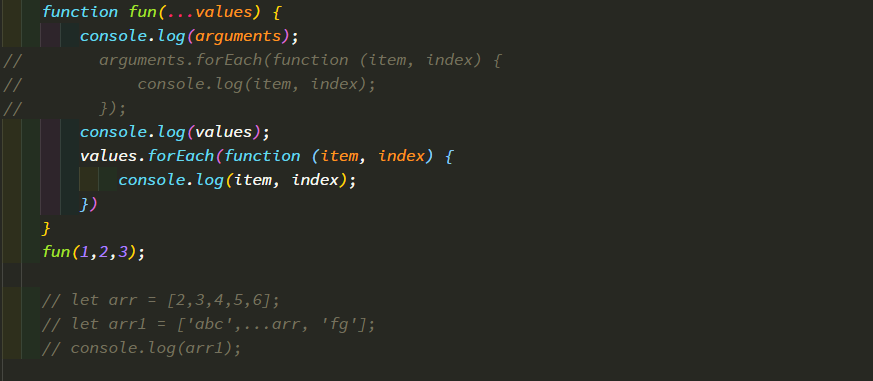

1. rest(可变)参数
  ```
  用来取代arguments 但比arguments灵活,只能是最后部分形参参数
  function add(...values) {
    let sum = 0;
    for(value of values) {
      sum += value;
    }
    return sum;
  }
  ```
2. 扩展运算符
    ```
    let arr1 = [1,3,5];
    let arr2 = [2,...arr1,6];
    arr2.push(...arr1);
    ```
  
  
  