## 原型与原型链

- 所有函数都有一个特别的属性:
  - 每个函数都有一个prototype属性, 它默认指向一个Object空对象(即称为: 原型对象)  
  - 原型对象中有一个属性constructor, 它指向函数对象

- 给原型对象添加属性(一般都是方法) 
  - 作用: 函数的所有实例对象自动拥有原型中的属性(方法)
  
- 所有实例对象都有一个特别的属性:
  - `__proto__` : 隐式原型属性
         
    ```
    //定义构造函数
    function Fn() { 
      // 内部语句: this.prototype = {}

    }

    // 1. 每个函数function都有一个prototype，即显式原型属性, 默认指向一个空的Object对象
    console.log(Fn.prototype)

    // 2. 每个实例对象都有一个__proto__，可称为隐式原型
    //创建实例对象
    var fn = new Fn()  // 内部语句: this.__proto__ = Fn.prototype
    console.log(fn.__proto__)

    // 3. 对象的隐式原型的值为其对应构造函数的显式原型的值
    console.log(Fn.prototype===fn.__proto__) // true

    //给原型添加方法
    Fn.prototype.test = function () {
      console.log('test()')
    }

    //通过实例调用原型的方法
    fn.test()
    ```
  
  
- 显式原型与隐式原型的关系
  - 函数的prototype: 定义函数时被自动赋值, 值默认为{}, 即用为原型对象
  - 实例对象的__proto__: 在创建实例对象时被自动添加, 并赋值为构造函数的prototype值
  - 原型对象即为当前实例对象的父对象
- 原型链
  - 所有的实例对象都有__proto__属性, 它指向的就是原型对象
  - 这样通过__proto__属性就形成了一个链的结构---->原型链
  - 当查找对象内部的属性/方法时, js引擎自动沿着这个原型链查找
  - 当给对象属性赋值时不会使用原型链, 而只是在当前对象中进行操作
  
  
显式原型与隐式原型  
  
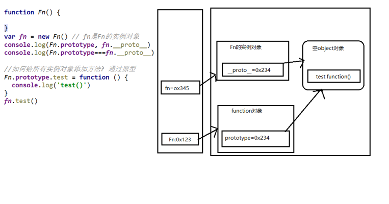
  
原型链分析

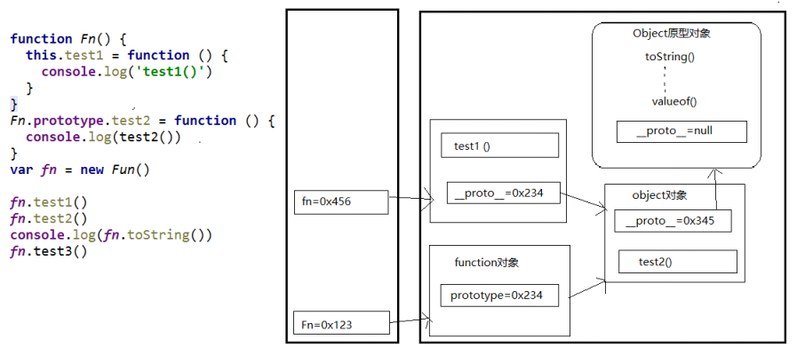  
  
原型链继承 

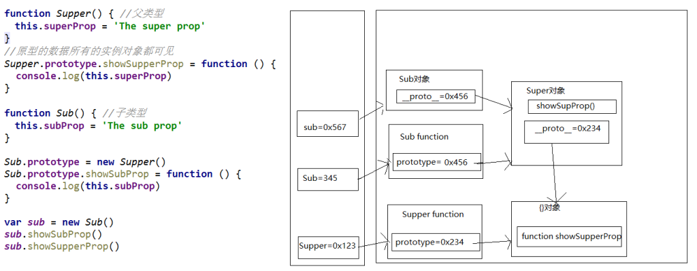  
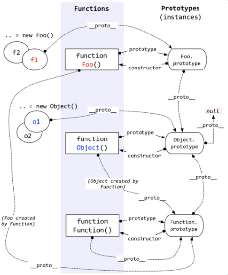  


 1. instanceof是如何判断的?  
    - 表达式: A instanceof B  
    - 如果B函数的显式原型对象在A对象的原型链上, 返回true, 否则返回false
 2. Function是通过new自己产生的实例

    ```
    /-
    案例1
      -/
    function Foo() {  }
    var f1 = new Foo()
    console.log(f1 instanceof Foo)                // true
    console.log(f1 instanceof Object)             // true
    
    /-
    案例2
      -/
      
    console.log(Object instanceof Function)       // true
    console.log(Object instanceof Object)         // true
    console.log(Function instanceof Function)     // true
    console.log(Function instanceof Object)       // true

    function Foo() {}
    console.log(Object instanceof  Foo)           // false
    ```

    ```
    测试题1
    function A () {

    }
    A.prototype.n = 1

    var b = new A()

    A.prototype = {
      n: 2,
      m: 3
    }

    var c = new A()
    console.log(b.n, b.m, c.n, c.m)              //1 undefined 2 3

    /-
      测试题2
      -/
    function F (){}
    Object.prototype.a = function(){
      console.log('a()')
    }
    Function.prototype.b = function(){
      console.log('b()')
    }

    var f = new F()
    f.a()                                             //a()
    // f.b()                                          //报错
    F.a()                                             //a()
    F.b()                                             //b()
    // console.log(f)
    // console.log(Object.prototype)
    // console.log(Function.prototype)

    ```

## 执行上下文与执行上下文栈
- 理解
  - 执行上下文: 由js引擎自动创建的对象, 包含对应作用域中的所有变量属性
  - 执行上下文栈: 用来管理产生的多个执行上下文，（栈的特点后进先出）

预处理机制
  js引擎在执行JavaScript脚本时，有两个阶段，预处理阶段 和 执行阶段          
  所以才会有变量提升和函数提升 
  1. 代码分类(位置) 
      - 全局代码 
      - 函数代码
  2. 全局执行上下文 （预处理阶段）
      - 在执行全局代码前将window确定为全局执行上下文  
      - 对全局数据进行预处理   
      - var定义的全局变量==>undefined, 添加为window的属性  
      - function声明的全局函数==>赋值(fun), 添加为window的方法  
      - this==>赋值(window) 
      - 开始执行全局代码
  3. 函数执行上下文 （预处理阶段）
      - 在调用函数, 准备执行函数体之前, 创建对应的函数执行上下文对象 
      - 对局部数据进行预处理  
      - 形参变量==>赋值(实参)==>添加为执行上下文的属性
      - arguments==>赋值(实参列表，伪数组), 添加为执行上下文的属性  
      - var定义的局部变量==>undefined, 添加为执行上下文的属性   
      - function声明的函数 ==>赋值(fun), 添加为执行上下文的方法  
      - this==>赋值(调用函数的对象) 
      - 开始执行函数体代码
              
- 执行上下文创建和初始化的过程
    - 全局:
      - 在全局代码执行前最先创建一个全局执行上下文(window)
      - 收集一些全局变量, 并初始化
      - 将这些变量设置为window的属性
    - 函数:
      - 在调用函数时, 在执行函数体之前先创建一个函数执行上下文
      - 收集一些局部变量, 并初始化
      - 将这些变量设置为执行上下文的属性                
  
- 整个过程中产生了几个执行上下文? 
      n+1原则    n代表调用多少次函数，1代表全局
  
- 生命周期
    - 全局 : 准备执行全局代码前产生, 当页面刷新/关闭页面时死亡
    - 函数 : 调用函数时产生, 函数执行完时死亡  
  
- 变量提升与函数提升（执行上下文，预处理的结果）
    - 变量提升: 在变量定义语句之前, 就可以访问到这个变量(undefined)
    - 函数提升: 在函数定义语句之前, 就执行该函数（原则上是先定义，后调用）
    - 在函数提升和变量提升的同时，函数提升的优先级高于变量提升，在js引擎渲染代码之时，
      函数会被提升到最顶部，然后变量提升。


  执行上下文理解题目：
  ```
  /-
  测试题1:  先执行变量提升, 再执行函数提升
  -/
  function a() {}
  var a
  console.log(typeof a) // 'function'

  /-
    测试题2:
    -/
  if (!(b in window)) {
    var b = 1
  }
  console.log(b) // undefined    因为if中的代码未执行

  /-
    测试题3:
    -/
  var c = 1
  function c(c) {
    console.log(c)
    var c = 3
  }
  c(2) // 报错
  
  第三题的代码相当于
  var c ;
  function c(c) {
    console.log(c)
    var c = 3
  }
  c=1;
  c(2) // 报错   
  1:所有的声明都会提升到作用域的最顶上去。

  2:同一个变量只会声明一次，其他的会被忽略掉。

  3:函数声明的优先级高于变量申明的优先级，并且函数声明和函数定义的部分一起被提升。
 
  ```
  
 
## 作用域与作用域链
- 理解:
  - 作用域: 一块代码区域, 在编码时就确定了, 不会再变化
  - 作用域链: 多个嵌套的作用域形成的由内向外的结构, 用于查找变量
  
- 理解 
  - 多个上下级关系的作用域形成的链, 它的方向是从下向上的(从内到外) 
  - 查找变量时就是沿着作用域链来查找的
- 查找一个变量的查找规则 
  - 在当前作用域下的执行上下文中查找对应的属性, 如果有直接返回, 否则进入外层
  - 在上一级作用域的执行上下文中查找对应的属性, 如果有直接返回, 否则进入外层
  - 再次执行的相同操作, 直到全局作用域, 如果还找不到就抛出找不到的异常          
             
- 分类:
  - 全局
  - 函数
  - js没有块作用域(在ES6之前，let块级作用域)
- 作用
  - 作用域: 隔离变量, 可以在不同作用域定义同名的变量不冲突
  - 作用域链: 查找变量
- 区别作用域与执行上下文
  - 作用域: 静态的, 编码时就确定了(不是在运行时), 一旦确定就不会变化了
  - 执行上下文: 动态的, 执行代码时动态创建, 当执行结束消失
  - 联系: 执行上下文环境是在对应的作用域中的


## 闭包 

  1. 产生闭包的条件?  
      - 函数嵌套 
      - 内部函数引用了外部函数的数据(变量/函数) 
      - 外部函数调用，内部函数执行定义，不用调用就能产生
  2. 闭包到底是什么? 
      - 使用chrome调试查看 
      - 理解一: 闭包是嵌套的内部函数(绝大部分人)  
      - 理解二: 内部函数+包含被引用变量(函数)的对象(极少数人)  
      - 注意: 闭包存在于嵌套的内部函数中

      
      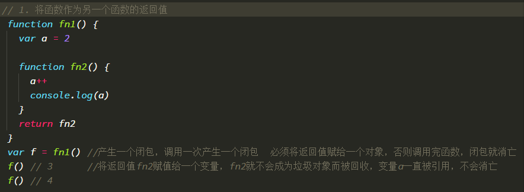

      以上两个例子产生了闭包，但是无实际意义


- 常见的闭包
  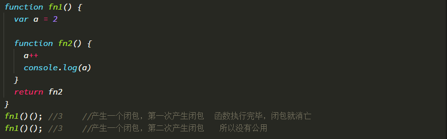
  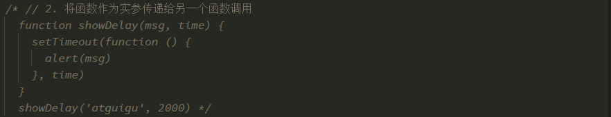

- 闭包作用:
  1. 使用函数内部的变量在函数执行完后, 可能仍然存活在内存中(可能延长了局部变量的生命周期)
  2. 可以让函数外部可以操作(读写)到函数内部的数据(变量/函数)
     - 问题:  
      1. 函数执行完后, 函数内部声明的局部变量是否还存在?  一般是不存在, 存在于闭包中的变量才可能存在 
      2. 在函数外部能直接访问函数内部的局部变量吗?          不能, 但我们可以通过闭包让外部操作它

- 闭包生命周期
  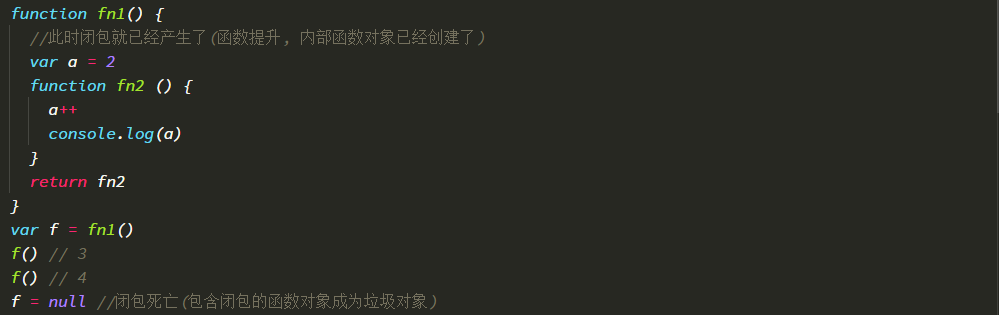   
        
- 闭包应用:
  - 模块化: 封装一些数据以及操作数据的函数, 向外暴露一些行为
  - 循环遍历加监听
  - JS框架(jQuery)大量使用了闭包
          
- JS模块化：（核心就是使用闭包）
  - 具有特定功能的js文件
  - 将所有的数据和功能都封装在一个函数内部(私有的)  
  - 只向外暴露一个包信n个方法的对象或函数 
  - 模块的使用者, 只需要通过模块暴露的对象调用方法来实现对应的功能  
  第一种：
   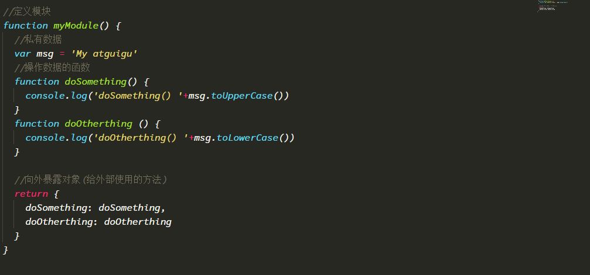
   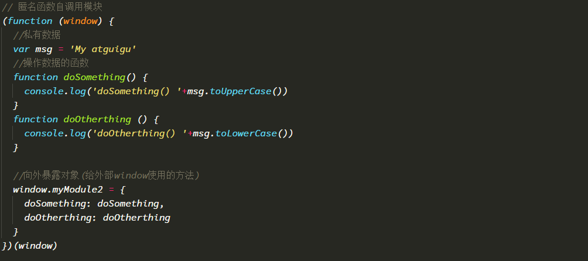          
         
  第二种：  （经常用的模块化）
              
          
- 缺点:
  - 变量占用内存的时间可能会过长
  - 可能导致内存泄露
  - 解决:
    - 及时释放 : f = null; //让内部函数对象成为垃圾对象
    
## 内存溢出与内存泄露
1. 内存溢出
  - 一种程序运行出现的错误
  - 当程序运行需要的内存超过了剩余的内存时, 就出抛出内存溢出的错误
2. 内存泄露
  - 占用的内存没有及时释放
  - 内存泄露积累多了就容易导致内存溢出
  - 常见的内存泄露:
    - 意外的全局变量
    - 没有及时清理的计时器或回调函数
    - 闭包
    
  面试题
   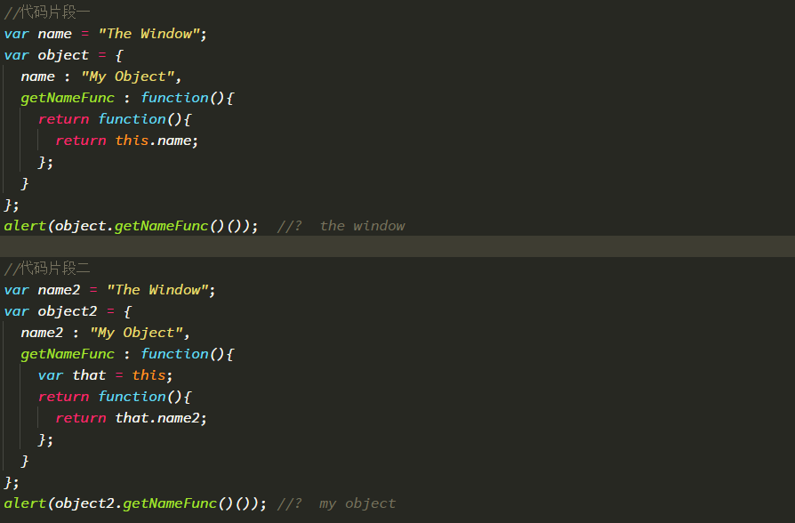           
  
  终极面试题（难道较大）
   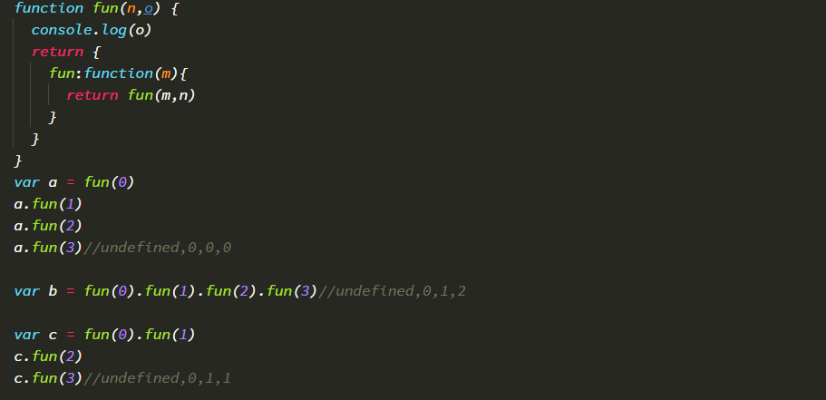           
 
 
 
 
 
  
    
    
    