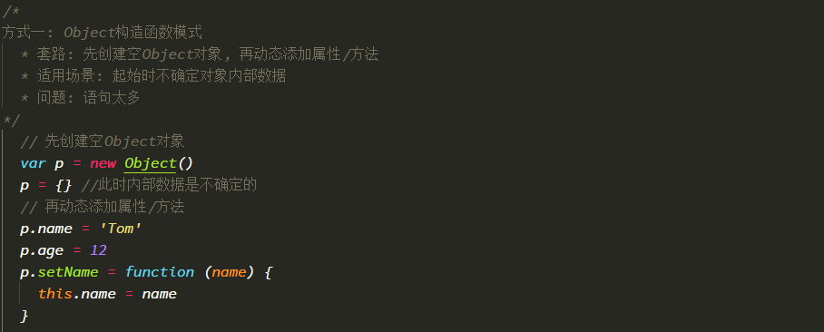
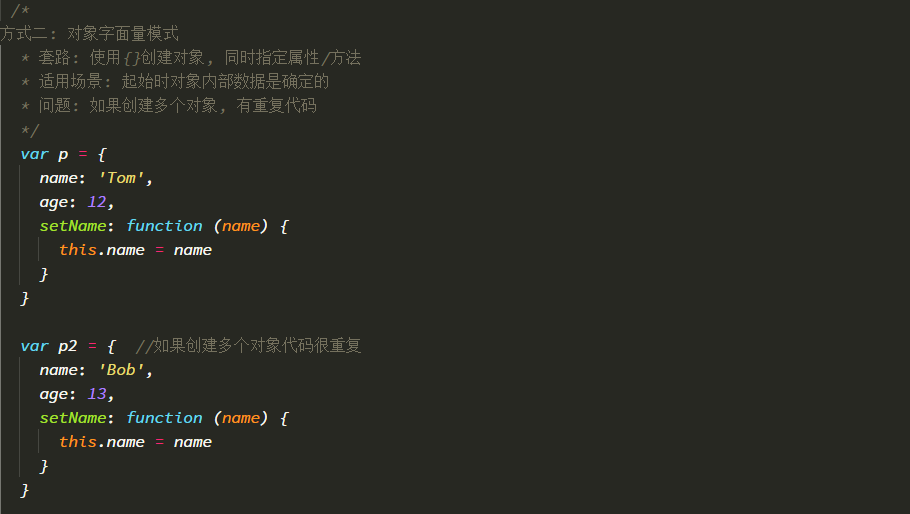
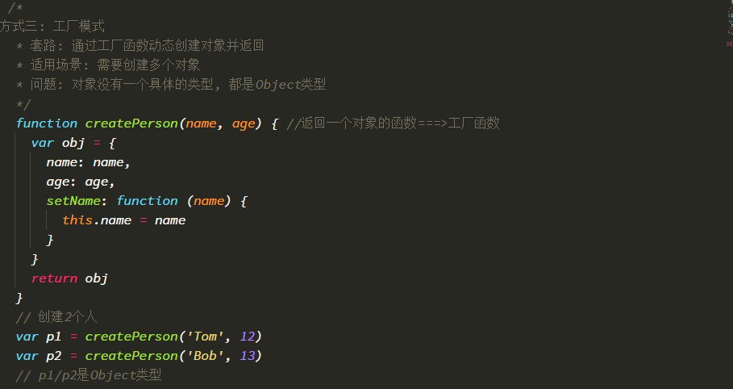
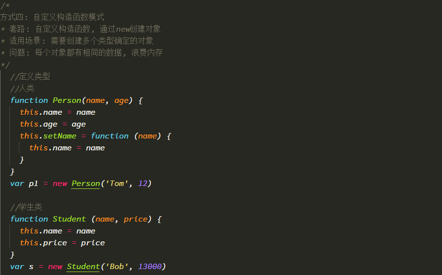
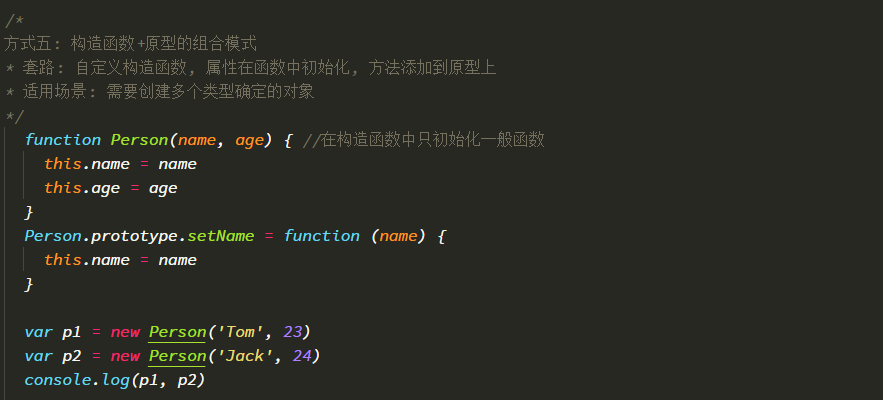
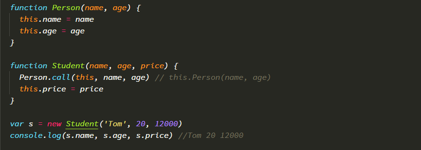
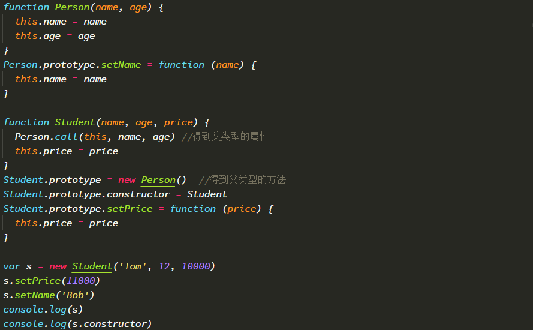

## 对象的创建模式

- Object构造函数模式


- 对象字面量模式


- 工厂函数（不用）


- 构造函数模式


- 构造函数+原型的组合模式



## 继承模式

- 原型链继承 : 得到方法
  ```
  方式1: 原型链继承
        1. 套路   
            1. 定义父类型构造函数   
            2. 给父类型的原型添加方法  
            3. 定义子类型的构造函数  
            4. 创建父类型的对象赋值给子类型的原型  
            5. 将子类型原型的构造属性设置为子类型   
            6. 给子类型原型添加方法   
            7. 创建子类型的对象: 可以调用父类型的方法 
        2. 关键  
            1. 子类型的原型为父类型的一个实例对象
  ```
  

- 借用构造函数 : 得到属性
  ```
  方式2: 借用构造函数继承(假的)
        1. 套路:  
            1. 定义父类型构造函数 
            2. 定义子类型构造函数  
            3. 在子类型构造函数中调用父类型构造
        2. 关键:  
            1. 在子类型构造函数中通用super()调用父类型构造函数
  ```
  

- 组合
  ```
  方式3:原型链+借用构造函数的组合继承
        1. 利用原型链实现对父类型对象的方法继承
        2. 利用call()借用父类型构建函数初始化相同属性
  ```
  
  

- new一个对象背后做了些什么?
  - 创建一个空对象
  - 给对象设置__proto__, 值为构造函数对象的prototype属性值   this.__proto__ = Fn.prototype
  - 执行构造函数体(给对象添加属性/方法)
  
  
  
  
  
  