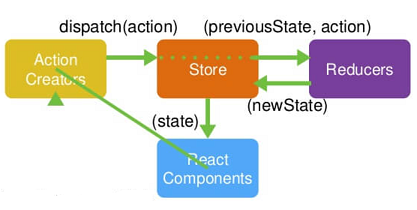

# <a id="list-four">4 Redux</a>

| 目录                                      |
| ----------------------------------------- |
| [4.1 redux 理解](#four-one)               |
| [4.2 redux 相关 API](#four-two)           |
| [4.3 redux 核心概念(3 个)](#four-three)   |
| [4.4 redux 工作流程(3 个)](#four-four)    |
| [4.5 使用 redux 及相关库编码](#four-five) |

### <a id="four-one" class='part-part'>4.1 redux 理解</a>

- 什么?: redux 是专门做状态管理的独立第 3 方库, 不是 react 插件
- 作用?: 对应用中状态进行集中式的管理(写/读)
- 开发: 与 react-redux, redux-thunk,redux-devtools-extension 等插件配合使用,4 个插件集合相当于 vuex
  - redux 状态管理库，提供 createStore
  - react-redux 连接 react 与 redux 的库，提供 connect
  - redux-thunk 让 actions 支持异步中间件
  - redux-devtools-extension 让浏览器能调试 redux

### <a id="four-two" class='part-part'>4.2 redux 相关 API</a>

- redux 中包含: `createStore(), applyMiddleware(), combineReducers()`
- store 对象: `getState(), dispatch(), subscribe()`
- react-redux: `<Provider>, connect()()`

### <a id="four-three" class='part-part'>4.3 redux 核心概念(3 个)</a>

- action:
  - 默认是对象(同步 action), `{type: 'xxx', data: value}`, 需要通过对应的 actionCreator 产生,
    它的值也可以是函数(异步 action), 需要引入 redux-thunk 才可以
- reducer
  - 根据老的 state 和指定的 action, 返回一个新的 state
    不能修改老的 state
- store
  - redux 最核心的管理对象
  - 内部管理着: state 和 reducer
  - 提供方法: getState(), dispatch(action), subscribe(listener)

### <a id="four-four" class='part-part'>4.4 redux 工作流程</a>



### <a id="four-five" class='part-part'>4.5 使用 redux 及相关库编码</a>

```
redux
react-redux
redux-thunk
redux-devtools-extension(这个只在开发时需要)
redux 文件夹:
    action-types.js
    actions.js
    reducers.js
    store.js
组件分 2 类:
    ui 组件(components): 不使用 redux 相关 API
    容器组件(containers): 使用 redux 相关 API
```

### 总结

- 参考文档：[Redux 中文文档](https://www.redux.org.cn/)
